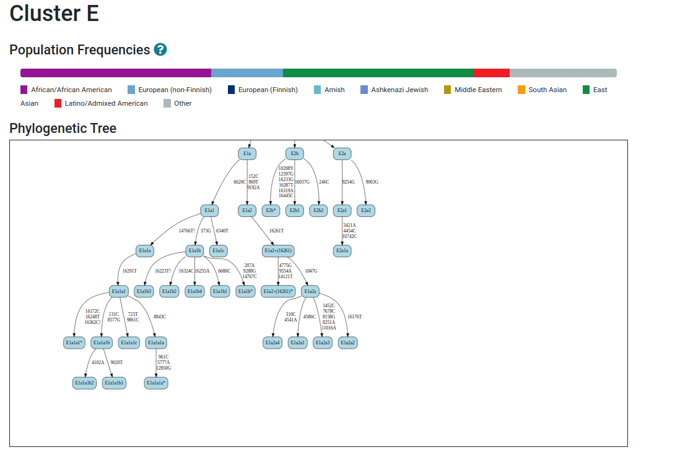
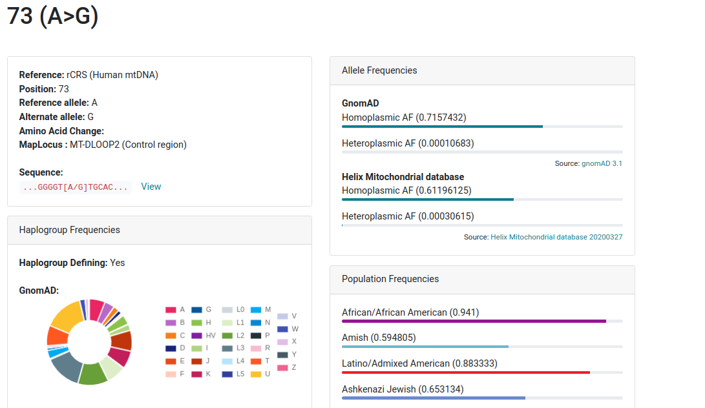

# Annotations
Starting with Haplogrep 3, the software includes new features for evaluating haplogroups or variants. This includes the possibility to get a visual representation of each top-level haplogroup including the expected variants for each haplogroup (see [here](https://haplogrep.i-med.ac.at/phylogenies)) or (b) get frequencies for each selected variant in the samples details page.

## Clusters
We generated 33 top-level clusters according to PhyloTree and gnomAD and (a) group each haplogroup from the phylogeny (b) group each input sample into one of these clusters displayed within the summary dashboard.

## Population Frequencies
 We also display numerous frequencies for each variant mainly derived from [gnomAD](https://gnomad.broadinstitute.org/). Further annotations are available from the [Helix Mitochondrial database](https://www.helix.com/pages/mitochondrial-variant-database) and functional predictions from [MitImpact](https://mitimpact.css-mendel.it/).

