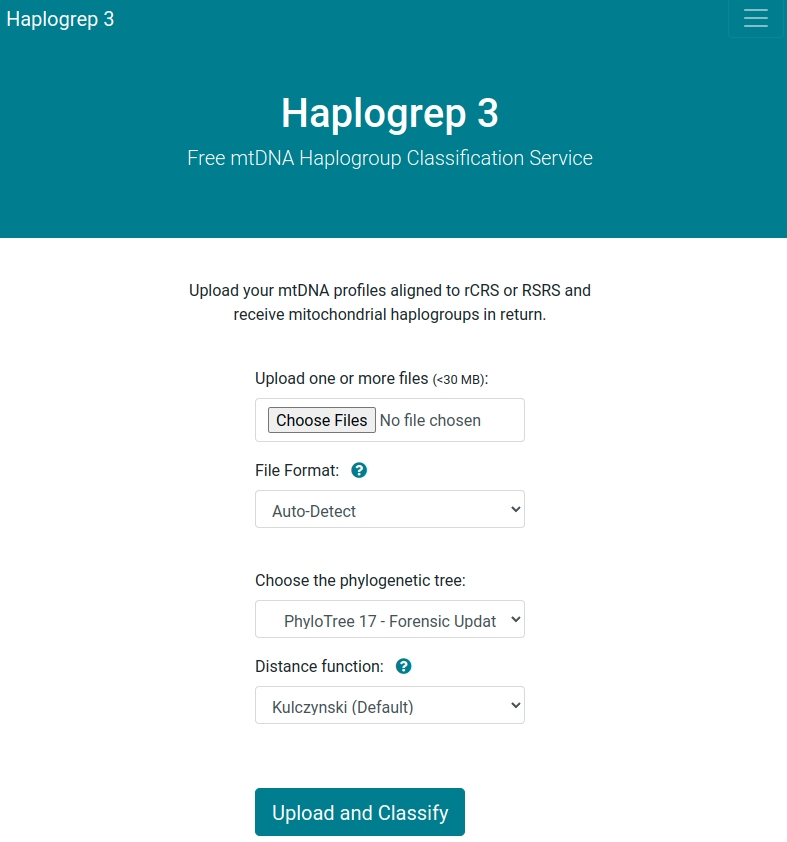
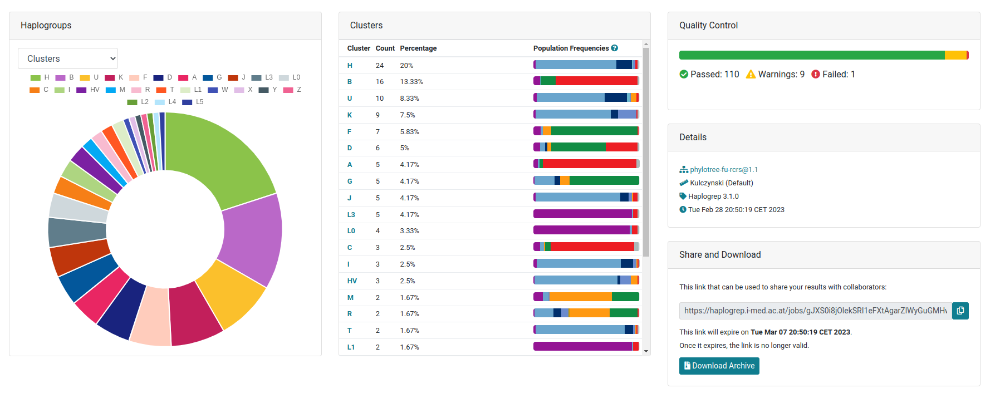
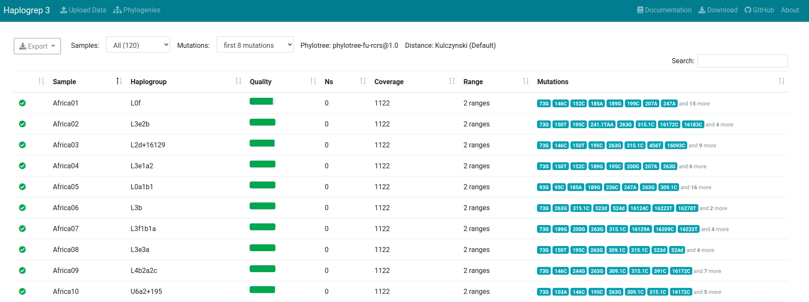
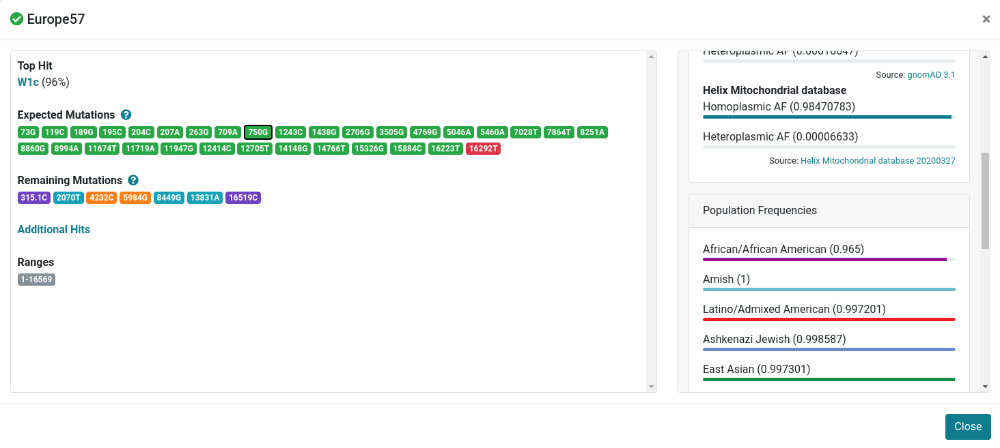
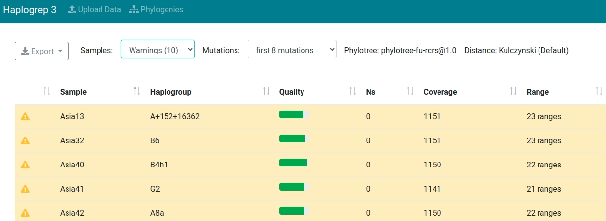
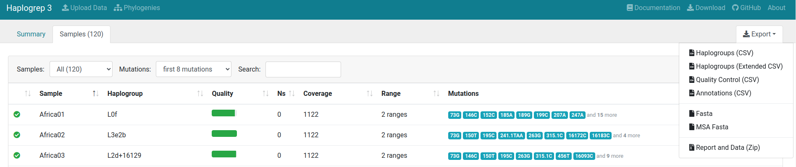

# Getting Started

This guide shows how to classify your data with the Haplogrep web service.

## Run
Click on [this link](https://haplogrep.i-med.ac.at) to open our web service hosted at the Medical University of Innsbruck. If you want to run it locally, please read about the installation [here](../installation).

## Uploading Data
After opening our web service, you see the following welcome screen. You can now upload your data in **FASTA**, **VCF** or **text-based** (hsd) format. The following input options are available:

* Haplogrep detects the file format automatically. Please note that additional input options appear (e.g. for VCF), when selecting a specific input format.
* Select one of the available distance functions ([Kulczynski](../kulczynski), Hamming, Jaccard).
* Select one of the available trees. Learn more about trees [here](../trees).  

## Classifying Haplogroups
After clicking **Upload and Classify** the data is preprocessed, classified, annotated, and results are directly displayed in the web interface.

## Summary Dashboard
The default tab includes summary statistics on the haplogroups clustered by the top-level haplogroup as defined by PhyloTree and gnomAD. The diagram can also be changed to display results on a haplogroup level. The table includes the numbers for each top-level haplogroup and also displays the frequencies for each defined population in gnomAD. The right hand side of the page includes the results of the quality control step using Haplogrep's rule-based system and displays a link that can be shared with researchers.  

## Sample Overview
By clicking on the Samples tab, the samples view will be openend. Each line displays a sample including the (a) name, (b) haplogroup, (c) quality, (d) number of N positions, (e) covered positions, (f) range and (g) input mutations. You can click on each sample to receive sample details.

## Sample Details
After clicking on one sample, a details view opens. In this view you will find the following information:

* All detected [errors and warnings](../errors-warnings) highlighted in yellow.
+ The haplogroup tophit (here: W1c) including the reached quality score in percentage. This is calculated by using one of our provided distance metrics.  
* The expected mutations for the tophit (W1c) marked in *green* and *red*. *Green* means that the mutation is required for the tophit and has also been found in the input sample. *Red* means that the mutation is required by the tophit but was not found in the input sample.
* The remaining mutations from the input sample. Hotspots are marked in *green*, local private mutations in *blue* and global private mutations in *red*.
* The detected ranges for the input sample.
* The 20 tophits for each sample (denoted by "Other Hits").
* By clicking on a specific variant (here for 750G), all available frequencies and genetic predictors from publicly available databases are displayed.

## Sample Filtering
Haplogrep allows to filter your samples according to their status. The screenshot below shows all samples including warnings within the input dataset.  

## Export Options
Haplogrep provides numerous export options. Currently you can export your data as a (a) csv file, (b) extended csv file including mutation details, (c) quality control file (csv), (d) an annotated file and (e) a zip file including the report and the uploaded data. If selected, Haplogrep also provides options for (a) fasta and (b) MSA fasta download. 
Please click [here](../annotations/#export) for detailed information on exported annotations.  

