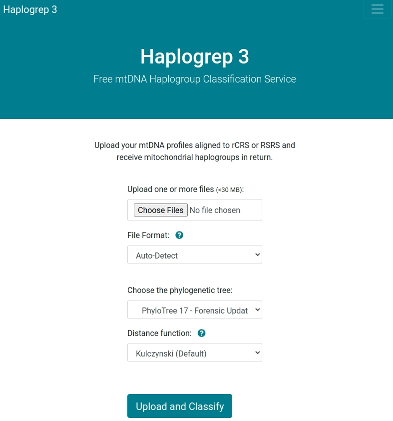

# Welcome to Haplogrep 3!

Haplogrep 3 is a fast and free haplogroup classification tool. Upload your mtDNA profiles in **FASTA**, **VCF** or **txt-based format** and receive mitochondrial haplogroups, summary statistics and variant annotations in return. We provide Haplogrep 3 as a graphical web service or as a command-line tool for local usage. As of today, Haplogrep have been cited> 1200 times (Google Scholar, February 28 2023).

